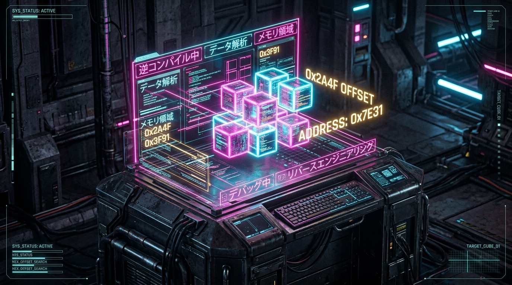
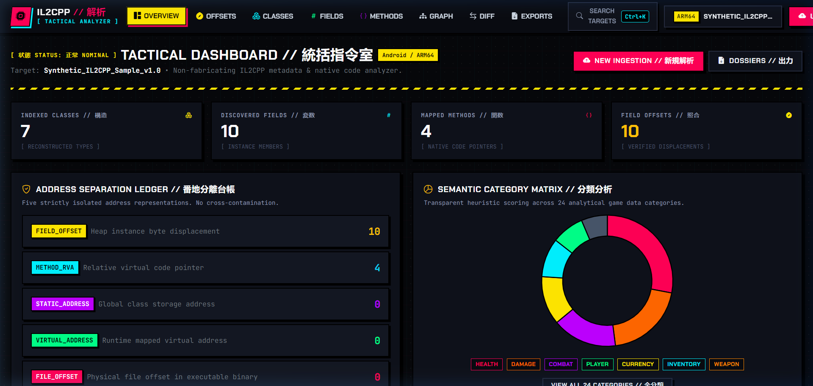
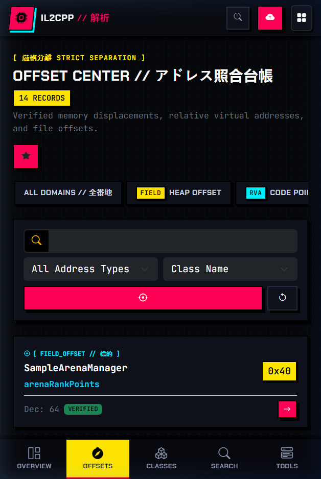
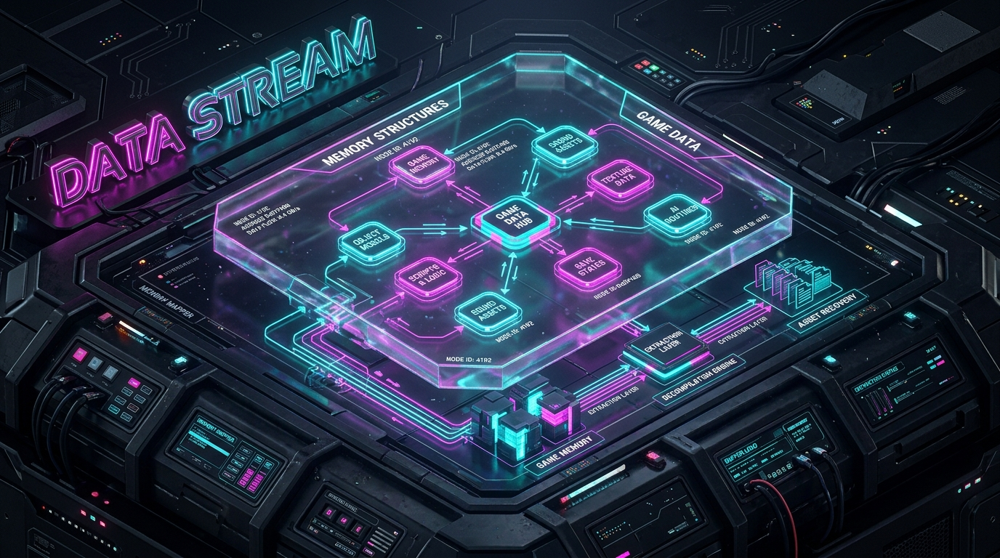

<div align="center">

# ⚡ IL2CPP GAME DATA & OFFSET ANALYZER
### // 統合リバースエンジニアリング台帳 • NEO-BRUTALISM × ANIME CYBERPUNK HUD

<br/>



<br/><br/>

[](https://www.python.org/)
[](https://www.djangoproject.com/)
[](https://github.com/sivanandan21/il2cpp-analyzer)
[](https://github.com/sivanandan21/il2cpp-analyzer)
[](https://render.com)
[](https://github.com/sivanandan21/il2cpp-analyzer)

<br/>

```
██╗██╗     ██████╗  ██████╗██████╗       █████╗ ███╗   ██╗ █████╗ ██╗  ██╗   ██╗███████╗███████╗██████╗ 
██║██║    ██╔════╝ ██╔════╝██╔══██╗     ██╔══██╗████╗  ██║██╔══██╗██║  ╚██╗ ██╔╝██╔════╝██╔════╝██╔══██╗
██║██║    ╚█████╗  ██║     ██████╔╝     ███████║██╔██╗ ██║███████║██║   ╚████╔╝ █████╗  █████╗  ██████╔╝
██║██║     ╚═══██╗ ██║     ██╔═══╝      ██╔══██║██║╚██╗██║██╔══██║██║    ╚██╔╝  ██╔══╝  ██╔══╝  ██╔══██╗
██║███████╗██████╔╝╚██████╗██║          ██║  ██║██║ ╚████║██║  ██║███████╗██║   ███████╗███████╗██║  ██║
╚═╝╚══════╝╚═════╝  ╚═════╝╚═╝          ╚═╝  ╚═╝╚═╝  ╚═══╝╚═╝  ╚═╝╚══════╝╚═╝   ╚══════╝╚══════╝╚═╝  ╚═╝
```

<p align="center">
  <b>A state-of-the-art browser-based reverse-engineering & memory layout inspection dashboard for IL2CPP binaries and runtime metadata.</b>
  <br />
  Strict address separation • Transparent heuristic scoring • Force-directed relation graphs • 100% Mobile Tactical HUD
</p>

[⚡ Live Demo (Render)](#-cloud-deployment--hosting) • [📖 Memory Architecture](#-3d-memory-architecture--offset-separation) • [🎮 Heuristic Engine](#-smart-heuristic-scoring-matrix) • [🚀 Quick Start](#-quick-start--local-setup) • [📡 API Docs](#-restful-json-api)

</div>

---

> [!IMPORTANT]
> **ANALYSIS & RESEARCH ONLY DIRECTIVE**
> This platform is an **analysis and memory inspection workbench** for authorized testing and educational research. It **does NOT** contain cheats, code injection engines, memory modifiers, or DRM circumvention tools. All offsets and RVAs are deterministically extracted from user-supplied dumps or native binaries.

---

## 📸 3D Holographic Interface Showcase

<div align="center">
  <table>
    <tr>
      <td width="65%" align="center">
        <b>🖥️ Command Center & Offset Ledger (Desktop)</b><br/><br/>
        
      </td>
      <td width="35%" align="center">
        <b>📱 Tactical Bottom HUD (Mobile)</b><br/><br/>
        
      </td>
    </tr>
  </table>
</div>

---

## 🔮 3D Memory Architecture & Offset Separation

IL2CPP decomposes managed C# code into C++ native structures. The engine strictly avoids the common pitfall of confusing **Field Offsets** (heap data offsets) with **Method RVAs** (code execution pointers).

<div align="center">
  
</div>

<br/>

```ascii
[ INSTANTIATED HEAP OBJECT ]
  0x0000 ┌────────────────────────────────────────────────────────┐
         │ Il2CppObject Header (vtable pointer & sync block)      │
  +0x018 │ m_CachedPtr / Native Unity GameObject reference        │
  +0x030 │ [FIELD_OFFSET: 0x30]  currentHealth (System.Single)    │ ◀─── Object Heap Memory Offset
  +0x034 │ [FIELD_OFFSET: 0x34]  maxHealth     (System.Single)    │      (Instance Byte Displacement)
  +0x038 │ [FIELD_OFFSET: 0x38]  movementSpeed (System.Single)    │
         └────────────────────────────────────────────────────────┘

[ NATIVE EXECUTABLE BINARY (libil2cpp.so / GameAssembly.dll) ]
  Preferred Image Base: 0x00000000 (ELF ARM64) / 0x180000000 (PE x64)
  ┌───────────────────────────────────────────────────────────────┐
  │ .text Section (Executable Machine Code)                       │
  │   RVA: +0x004F2B80  ──▶ TakeDamage(float amount)              │ ◀─── METHOD_RVA (Relative Virtual Address)
  │   RVA: +0x004F3120  ──▶ Die()                                 │
  ├───────────────────────────────────────────────────────────────┤
  │ .data / .bss Section (Global Static Pointers)                 │
  │   Static Pointer: 0x00E28B10 ──▶ PlayerController.Instance    │ ◀─── STATIC_ADDRESS (Runtime Singleton Pointer)
  └───────────────────────────────────────────────────────────────┘
```

| Address Category | Symbol | Definition & Usage |
| :--- | :---: | :--- |
| **`FIELD_OFFSET`** | `+0x...` | Byte offset inside instantiated heap object memory. **Never an executable code pointer.** |
| **`METHOD_RVA`** | `RVA` | Relative Virtual Address of compiled machine code from native image base. |
| **`VIRTUAL_ADDRESS`** | `VA` | Calculated runtime virtual memory address (`ImageBase + RVA`). |
| **`FILE_OFFSET`** | `FILE` | Physical raw byte offset on storage disk within the ELF/PE container. |
| **`STATIC_ADDRESS`** | `STATIC` | Absolute memory address pointer for static class members & singletons. |

---

## ⚡ Core Arsenal & Capabilities

```mermaid
graph LR
    subgraph INGESTION ["📥 Ingestion Pipeline"]
        A["dump.cs (Il2CppDumper)"] --> P["Parser Core"]
        B["global-metadata.dat"] --> P
        C["libil2cpp.so / GameAssembly.dll"] --> P
        D["APK / ZIP Packages"] --> P
    end

    subgraph ENGINE ["⚙️ Analytical Core"]
        P --> E["ELF/PE Machine Parser"]
        P --> M["Metadata Reconstructor"]
        M --> S["Semantic Heuristic Scorer"]
        M --> R["Relation Graph Engine"]
    end

    subgraph OUTPUT ["📊 Output & Presentation"]
        S --> UI["Neo-Brutalism Cyber UI"]
        S --> API["RESTful JSON Endpoints"]
        S --> EXP["Markdown / CSV Reports"]
    end

    style INGESTION fill:#0b0d19,stroke:#00f0ff,stroke-width:2px;
    style ENGINE fill:#0b0d19,stroke:#ff0055,stroke-width:2px;
    style OUTPUT fill:#0b0d19,stroke:#00ff88,stroke-width:2px;
```



* **⚡ Automated Ingestion**: Direct parsing of `dump.cs`, raw `global-metadata.dat`, native ELF (`libil2cpp.so`) and PE (`GameAssembly.dll`) binaries, and full APK archives with automated sub-path extraction.
* **🎯 24 Heuristic Categories**: Automatic tagging across `HEALTH`, `DAMAGE`, `SPEED`, `CURRENCY`, `COOLDOWN`, `AMMO`, `COMBAT`, `NETWORK`, `ENCRYPTION`, and more.
* **🛡️ False-Positive Filtering**: Intelligently downgrades UI elements (`HealthBar.Update()`, `DamageVFXController`) while elevating true state stores (`PlayerStats.currentHealth`).
* **🕸️ 3D Relation Graph**: Interactive Force-Directed Canvas visualizing inheritance chains, field compositions, nested types, and cross-assembly dependencies with pinch-zoom support.
* **📑 One-Click Dossiers**: Auto-generates `ImportantData.md`, `ImportantOffsets.md`, `field_offsets.csv`, and `offsets.json`.
* **📱 Tactical HUD for Mobile**: 100% responsive bottom navigation HUD with swipeable horizontal category carousels and touch-friendly target dossier cards.

---

## 🎯 Smart Heuristic Scoring Matrix

Each extracted entity receives a transparent score between **0 and 100**:

```
TOTAL_SCORE = Σ(Positive Signals) - Σ(Negative Penalties)
```

| Factor | Points | Evaluation Rationale |
| :--- | :---: | :--- |
| **Keyword Match** | `+25` | Direct match with category vocabulary (e.g. `health`, `attack`, `gold`). |
| **Primitive Type** | `+20` | Native numerical value (`float`, `int32`, `double`, `bool`). |
| **Class Relevance** | `+18` | Declared in a high-priority context (e.g. `CharacterData`, `Wallet`). |
| **Sibling Context** | `+15` | Co-located with counterpart fields (e.g. `currentHealth` next to `maxHealth`). |
| **Namespace Scope**| `+10` | Enclosed within gameplay namespaces (`Game.Combat`, `Gameplay.Stats`). |
| **UI/VFX Penalty**  | `-30` | Heavy penalty for display/visual logic (`HealthBarView`, `DamageNumberSpawner`). |

---

## 🚀 Quick Start & Local Setup

### 1. Clone Repository
```bash
git clone https://github.com/sivanandan21/il2cpp-analyzer.git
cd il2cpp-analyzer
```

### 2. Set Up Virtual Environment
```bash
# Windows
python -m venv venv
venv\Scripts\activate

# Linux / macOS
python3 -m venv venv
source venv/bin/activate
```

### 3. Install Dependencies
```bash
pip install -r requirements.txt
```

### 4. Run Migrations & Load Reference Project
```bash
python manage.py migrate
python manage.py load_sample_data
```

### 5. Launch the Command Terminal
```bash
python manage.py runserver 127.0.0.1:8000
```
Open **[http://127.0.0.1:8000](http://127.0.0.1:8000)** in your browser!

---

## 🌐 Cloud Deployment & Hosting

### Option 1: 1-Click Deploy on [Render.com](https://render.com) *(Recommended)*
This repository includes a native [`render.yaml`](render.yaml) blueprint:
1. Log in to **[dashboard.render.com](https://dashboard.render.com)**.
2. Click **New +** → **Blueprint** (or **Web Service**).
3. Connect your repository `sivanandan21/il2cpp-analyzer`.
4. Render will auto-run:
   ```bash
   pip install -r requirements.txt && python manage.py migrate && python manage.py load_sample_data && python manage.py collectstatic --noinput
   ```
5. Your service is live under a free HTTPS domain!

### Option 2: Docker Container (Any Cloud Host)
```bash
docker build -t il2cpp-analyzer .
docker run -p 8000:8000 il2cpp-analyzer
```

### Option 3: Netlify Edge Reverse-Proxy
To use a custom `.netlify.app` domain with your Render backend, configure the included [`netlify.toml`](netlify.toml):
```toml
[[redirects]]
  from = "/*"
  to = "https://your-render-app.onrender.com/:splat"
  status = 200
  force = true
```

---

## 📡 RESTful JSON API

| Method | Endpoint | Description |
| :---: | :--- | :--- |
| `GET` | `/api/projects/` | List all indexed IL2CPP projects |
| `GET` | `/api/projects/<id>/` | Project metadata, platform ABI & stats |
| `GET` | `/api/classes/?project_id=<id>` | Filtered class definitions |
| `GET` | `/api/fields/?project_id=<id>` | Extracted fields & verified `FIELD_OFFSET` |
| `GET` | `/api/methods/?project_id=<id>` | Extracted methods & verified `METHOD_RVA` |
| `GET` | `/api/offsets/?project_id=<id>&type=FIELD_OFFSET` | Normalized address ledger |
| `GET` | `/api/search/?q=health` | Global multi-index regex query |
| `GET` | `/api/graph/?project_id=<id>` | D3/Force-directed node graph layout |

---

## 🧪 Automated Test Verification

The engine is covered by a comprehensive automated test suite verifying ELF/PE relocations, ZIP bomb prevention, metadata table extraction, and heuristic scores:

```bash
python manage.py test analyzer.tests --verbosity=2
```
```
Ran 21 tests in 0.098s
OK (System check identified no issues: 0 silenced)
```

---

<div align="center">

### // システム正常稼働中 • SYSTEM STATUS: ACTIVE
Crafted with passion for game security research & reverse engineering.

<b>[⬆ Back to Top](#-il2cpp-game-data--offset-analyzer)</b>

</div>
